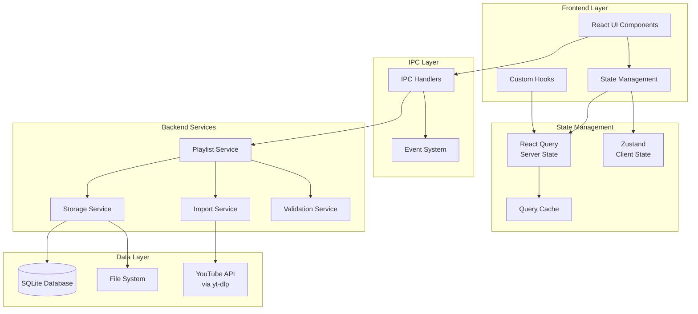
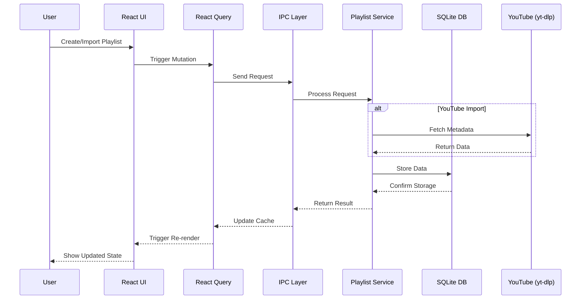

# Design Document: Playlist Management & Local Storage

## Overview

This design document outlines the architecture and implementation approach for Phase 2 of the Playlistify application, focusing on comprehensive playlist management capabilities and robust local storage solutions. The design builds upon the foundational infrastructure established in Phase 1 and introduces the core user-facing features that define the application's primary value proposition.

The system is designed around four key pillars: intuitive playlist creation interfaces, robust YouTube integration, efficient local data management, and responsive user experience. The architecture emphasizes performance, reliability, and scalability while maintaining a clean separation of concerns between data management, business logic, and user interface layers.

## Architecture

### System Architecture Overview



### Data Flow Architecture



## Components and Interfaces

### Frontend Components

#### Core UI Components

```typescript
// Playlist Creation Dialog
interface AddPlaylistDialogProps {
  isOpen: boolean;
  onClose: () => void;
  onSuccess: (playlist: Playlist) => void;
}

// Playlist Grid Display
interface PlaylistGridProps {
  playlists: Playlist[];
  viewMode: 'grid' | 'list';
  onPlaylistSelect: (id: string) => void;
  onPlaylistAction: (action: PlaylistAction, id: string) => void;
}

// Playlist Actions Bar
interface PlaylistActionsBarProps {
  searchQuery: string;
  onSearchChange: (query: string) => void;
  sortBy: SortOption;
  onSortChange: (sort: SortOption) => void;
  filterBy: FilterOption;
  onFilterChange: (filter: FilterOption) => void;
}
```

#### State Management Interfaces

```typescript
// React Query Keys
export const playlistKeys = {
  all: ['playlists'] as const,
  lists: () => [...playlistKeys.all, 'list'] as const,
  list: (filters: PlaylistFilters) => [...playlistKeys.lists(), filters] as const,
  details: () => [...playlistKeys.all, 'detail'] as const,
  detail: (id: string) => [...playlistKeys.details(), id] as const,
};

// Zustand Store Interface
interface PlaylistStore {
  // UI State
  selectedPlaylists: string[];
  viewMode: 'grid' | 'list';
  searchQuery: string;
  sortBy: SortOption;
  filterBy: FilterOption;
  
  // Actions
  setSelectedPlaylists: (ids: string[]) => void;
  togglePlaylistSelection: (id: string) => void;
  setViewMode: (mode: 'grid' | 'list') => void;
  setSearchQuery: (query: string) => void;
  setSortBy: (sort: SortOption) => void;
  setFilterBy: (filter: FilterOption) => void;
  
  // Computed
  filteredPlaylists: (playlists: Playlist[]) => Playlist[];
  sortedPlaylists: (playlists: Playlist[]) => Playlist[];
}
```

### Backend Service Interfaces

#### Playlist Service

```typescript
interface PlaylistService {
  // CRUD Operations
  createPlaylist(data: CreatePlaylistData): Promise<Playlist>;
  getPlaylist(id: string): Promise<Playlist | null>;
  getAllPlaylists(filters?: PlaylistFilters): Promise<Playlist[]>;
  updatePlaylist(id: string, data: UpdatePlaylistData): Promise<Playlist>;
  deletePlaylist(id: string): Promise<void>;
  
  // Import Operations
  importFromYouTube(url: string): Promise<ImportResult>;
  validateYouTubeUrl(url: string): Promise<ValidationResult>;
  getImportPreview(url: string): Promise<PlaylistPreview>;
  
  // Batch Operations
  duplicatePlaylist(id: string): Promise<Playlist>;
  mergePlaylists(ids: string[]): Promise<Playlist>;
  exportPlaylists(ids: string[], format: ExportFormat): Promise<ExportResult>;
}
```

#### Storage Service

```typescript
interface StorageService {
  // Database Operations
  initializeDatabase(): Promise<void>;
  migrateDatabase(version: number): Promise<void>;
  backupDatabase(): Promise<string>;
  restoreDatabase(backupPath: string): Promise<void>;
  
  // Query Operations
  executeQuery<T>(query: string, params?: any[]): Promise<T[]>;
  executeTransaction(operations: DatabaseOperation[]): Promise<void>;
  
  // Optimization
  optimizeDatabase(): Promise<void>;
  getStorageStats(): Promise<StorageStats>;
}
```

### IPC Communication Interfaces

```typescript
// IPC Channel Definitions
interface PlaylistIPC {
  // Playlist Management
  'playlist:create': (data: CreatePlaylistData) => Promise<Playlist>;
  'playlist:get': (id: string) => Promise<Playlist | null>;
  'playlist:getAll': (filters?: PlaylistFilters) => Promise<Playlist[]>;
  'playlist:update': (id: string, data: UpdatePlaylistData) => Promise<Playlist>;
  'playlist:delete': (id: string) => Promise<void>;
  
  // Import Operations
  'playlist:import': (url: string) => Promise<ImportResult>;
  'playlist:preview': (url: string) => Promise<PlaylistPreview>;
  'playlist:validate-url': (url: string) => Promise<ValidationResult>;
  
  // Batch Operations
  'playlist:duplicate': (id: string) => Promise<Playlist>;
  'playlist:merge': (ids: string[]) => Promise<Playlist>;
  'playlist:export': (ids: string[], format: ExportFormat) => Promise<ExportResult>;
}
```

## Data Models

### Core Data Models

```typescript
// Playlist Model
interface Playlist {
  id: string;
  title: string;
  description?: string;
  type: 'custom' | 'youtube';
  source?: string; // YouTube URL for imported playlists
  thumbnail?: string;
  videoCount: number;
  totalDuration: number;
  tags: string[];
  isPrivate: boolean;
  createdAt: Date;
  updatedAt: Date;
  lastAccessedAt: Date;
  metadata: PlaylistMetadata;
}

// Video Model (within playlists)
interface PlaylistVideo {
  id: string;
  playlistId: string;
  videoId: string;
  title: string;
  description?: string;
  thumbnail: string;
  duration: number;
  channelName: string;
  channelId: string;
  publishedAt: Date;
  position: number;
  availabilityStatus: 'available' | 'unavailable' | 'private' | 'deleted';
  downloadStatus?: 'not_downloaded' | 'downloading' | 'downloaded' | 'failed';
  localPath?: string;
  addedAt: Date;
}

// Import/Export Models
interface ImportResult {
  success: boolean;
  playlist?: Playlist;
  errors: ImportError[];
  warnings: ImportWarning[];
  stats: ImportStats;
}

interface ExportResult {
  success: boolean;
  filePath?: string;
  format: ExportFormat;
  errors: ExportError[];
  stats: ExportStats;
}
```

### Database Schema

```sql
-- Playlists table
CREATE TABLE playlists (
  id TEXT PRIMARY KEY,
  title TEXT NOT NULL UNIQUE,
  description TEXT,
  type TEXT NOT NULL CHECK (type IN ('custom', 'youtube')),
  source TEXT, -- YouTube URL for imported playlists
  thumbnail TEXT,
  video_count INTEGER DEFAULT 0,
  total_duration INTEGER DEFAULT 0,
  tags TEXT, -- JSON array of tags
  is_private BOOLEAN DEFAULT FALSE,
  created_at DATETIME DEFAULT CURRENT_TIMESTAMP,
  updated_at DATETIME DEFAULT CURRENT_TIMESTAMP,
  last_accessed_at DATETIME DEFAULT CURRENT_TIMESTAMP,
  metadata TEXT -- JSON metadata
);

-- Videos table
CREATE TABLE videos (
  id TEXT PRIMARY KEY,
  video_id TEXT NOT NULL, -- YouTube video ID
  title TEXT NOT NULL,
  description TEXT,
  thumbnail TEXT,
  duration INTEGER,
  channel_name TEXT,
  channel_id TEXT,
  published_at DATETIME,
  availability_status TEXT DEFAULT 'available',
  download_status TEXT DEFAULT 'not_downloaded',
  local_path TEXT,
  created_at DATETIME DEFAULT CURRENT_TIMESTAMP,
  updated_at DATETIME DEFAULT CURRENT_TIMESTAMP
);

-- Playlist-Video junction table
CREATE TABLE playlist_videos (
  playlist_id TEXT NOT NULL,
  video_id TEXT NOT NULL,
  position INTEGER NOT NULL,
  added_at DATETIME DEFAULT CURRENT_TIMESTAMP,
  PRIMARY KEY (playlist_id, video_id),
  FOREIGN KEY (playlist_id) REFERENCES playlists(id) ON DELETE CASCADE,
  FOREIGN KEY (video_id) REFERENCES videos(id) ON DELETE CASCADE
);

-- Indexes for performance
CREATE INDEX idx_playlists_type ON playlists(type);
CREATE INDEX idx_playlists_updated_at ON playlists(updated_at);
CREATE INDEX idx_videos_video_id ON videos(video_id);
CREATE INDEX idx_videos_availability_status ON videos(availability_status);
CREATE INDEX idx_playlist_videos_playlist_id ON playlist_videos(playlist_id);
CREATE INDEX idx_playlist_videos_position ON playlist_videos(playlist_id, position);
```

## Error Handling

### Error Classification

```typescript
// Error Types
enum PlaylistErrorType {
  VALIDATION_ERROR = 'VALIDATION_ERROR',
  NETWORK_ERROR = 'NETWORK_ERROR',
  DATABASE_ERROR = 'DATABASE_ERROR',
  YOUTUBE_ERROR = 'YOUTUBE_ERROR',
  FILE_SYSTEM_ERROR = 'FILE_SYSTEM_ERROR',
  PERMISSION_ERROR = 'PERMISSION_ERROR',
  QUOTA_ERROR = 'QUOTA_ERROR'
}

// Error Interface
interface PlaylistError extends Error {
  type: PlaylistErrorType;
  code: string;
  details?: Record<string, any>;
  recoverable: boolean;
  retryable: boolean;
}
```

### Error Handling Strategy

```typescript
// Error Handler Service
class ErrorHandlerService {
  handleError(error: PlaylistError): ErrorHandlingResult {
    switch (error.type) {
      case PlaylistErrorType.NETWORK_ERROR:
        return this.handleNetworkError(error);
      case PlaylistErrorType.DATABASE_ERROR:
        return this.handleDatabaseError(error);
      case PlaylistErrorType.YOUTUBE_ERROR:
        return this.handleYouTubeError(error);
      default:
        return this.handleGenericError(error);
    }
  }
  
  private handleNetworkError(error: PlaylistError): ErrorHandlingResult {
    if (error.retryable) {
      return {
        action: 'retry',
        delay: this.calculateBackoffDelay(error),
        maxRetries: 3
      };
    }
    return { action: 'fail', userMessage: 'Network connection failed' };
  }
  
  private handleDatabaseError(error: PlaylistError): ErrorHandlingResult {
    // Attempt database recovery
    if (error.recoverable) {
      return {
        action: 'recover',
        recoveryMethod: 'database_repair'
      };
    }
    return { action: 'fail', userMessage: 'Database error occurred' };
  }
}
```

## Testing Strategy

### Unit Testing

```typescript
// Playlist Service Tests
describe('PlaylistService', () => {
  describe('createPlaylist', () => {
    it('should create a custom playlist with valid data', async () => {
      const data = {
        title: 'Test Playlist',
        description: 'Test Description',
        type: 'custom' as const
      };
      
      const result = await playlistService.createPlaylist(data);
      
      expect(result).toMatchObject({
        title: 'Test Playlist',
        description: 'Test Description',
        type: 'custom'
      });
      expect(result.id).toBeDefined();
      expect(result.createdAt).toBeInstanceOf(Date);
    });
    
    it('should reject duplicate playlist titles', async () => {
      await playlistService.createPlaylist({
        title: 'Duplicate Test',
        type: 'custom'
      });
      
      await expect(
        playlistService.createPlaylist({
          title: 'Duplicate Test',
          type: 'custom'
        })
      ).rejects.toThrow('Playlist title already exists');
    });
  });
});
```

### Integration Testing

```typescript
// YouTube Import Integration Tests
describe('YouTube Import Integration', () => {
  it('should successfully import a public playlist', async () => {
    const testUrl = 'https://www.youtube.com/playlist?list=PLtest123';
    
    const result = await playlistService.importFromYouTube(testUrl);
    
    expect(result.success).toBe(true);
    expect(result.playlist).toBeDefined();
    expect(result.playlist!.type).toBe('youtube');
    expect(result.playlist!.source).toBe(testUrl);
    expect(result.playlist!.videoCount).toBeGreaterThan(0);
  });
  
  it('should handle private playlist gracefully', async () => {
    const privateUrl = 'https://www.youtube.com/playlist?list=PLprivate123';
    
    const result = await playlistService.importFromYouTube(privateUrl);
    
    expect(result.success).toBe(false);
    expect(result.errors).toContainEqual(
      expect.objectContaining({
        type: PlaylistErrorType.YOUTUBE_ERROR,
        code: 'PRIVATE_PLAYLIST'
      })
    );
  });
});
```

### Performance Testing

```typescript
// Performance Test Suite
describe('Performance Tests', () => {
  it('should handle 1000 playlists efficiently', async () => {
    // Create 1000 test playlists
    const playlists = await createTestPlaylists(1000);
    
    const startTime = performance.now();
    const result = await playlistService.getAllPlaylists();
    const endTime = performance.now();
    
    expect(result.length).toBe(1000);
    expect(endTime - startTime).toBeLessThan(1000); // Less than 1 second
  });
  
  it('should search large collections quickly', async () => {
    await createTestPlaylists(1000);
    
    const startTime = performance.now();
    const results = await playlistService.getAllPlaylists({
      search: 'test query'
    });
    const endTime = performance.now();
    
    expect(endTime - startTime).toBeLessThan(500); // Less than 500ms
  });
});
```

## Performance Optimization

### Database Optimization

```typescript
// Query Optimization
class PlaylistRepository {
  async getPlaylistsWithPagination(
    offset: number,
    limit: number,
    filters?: PlaylistFilters
  ): Promise<{ playlists: Playlist[]; total: number }> {
    const whereClause = this.buildWhereClause(filters);
    
    // Use prepared statements for better performance
    const countQuery = this.db.prepare(`
      SELECT COUNT(*) as total FROM playlists ${whereClause}
    `);
    
    const dataQuery = this.db.prepare(`
      SELECT * FROM playlists ${whereClause}
      ORDER BY updated_at DESC
      LIMIT ? OFFSET ?
    `);
    
    const [{ total }] = countQuery.all();
    const playlists = dataQuery.all(limit, offset);
    
    return { playlists, total };
  }
  
  // Batch operations for efficiency
  async createMultiplePlaylists(playlistsData: CreatePlaylistData[]): Promise<Playlist[]> {
    const insertStmt = this.db.prepare(`
      INSERT INTO playlists (id, title, description, type, created_at, updated_at)
      VALUES (?, ?, ?, ?, ?, ?)
    `);
    
    const transaction = this.db.transaction((playlists: CreatePlaylistData[]) => {
      return playlists.map(data => {
        const id = generateId();
        const now = new Date().toISOString();
        insertStmt.run(id, data.title, data.description, data.type, now, now);
        return { id, ...data, createdAt: new Date(now), updatedAt: new Date(now) };
      });
    });
    
    return transaction(playlistsData);
  }
}
```

### Frontend Optimization

```typescript
// Virtual Scrolling for Large Lists
const PlaylistGrid: React.FC<PlaylistGridProps> = ({ playlists }) => {
  const parentRef = useRef<HTMLDivElement>(null);
  
  const virtualizer = useVirtualizer({
    count: playlists.length,
    getScrollElement: () => parentRef.current,
    estimateSize: () => 200, // Estimated item height
    overscan: 5
  });
  
  return (
    <div ref={parentRef} className="h-96 overflow-auto">
      <div
        style={{
          height: `${virtualizer.getTotalSize()}px`,
          width: '100%',
          position: 'relative'
        }}
      >
        {virtualizer.getVirtualItems().map(virtualItem => (
          <div
            key={virtualItem.key}
            style={{
              position: 'absolute',
              top: 0,
              left: 0,
              width: '100%',
              height: `${virtualItem.size}px`,
              transform: `translateY(${virtualItem.start}px)`
            }}
          >
            <PlaylistCard playlist={playlists[virtualItem.index]} />
          </div>
        ))}
      </div>
    </div>
  );
};

// Optimized Search with Debouncing
const usePlaylistSearch = (playlists: Playlist[]) => {
  const [searchQuery, setSearchQuery] = useState('');
  const debouncedQuery = useDebounce(searchQuery, 300);
  
  const filteredPlaylists = useMemo(() => {
    if (!debouncedQuery) return playlists;
    
    const query = debouncedQuery.toLowerCase();
    return playlists.filter(playlist =>
      playlist.title.toLowerCase().includes(query) ||
      playlist.description?.toLowerCase().includes(query) ||
      playlist.tags.some(tag => tag.toLowerCase().includes(query))
    );
  }, [playlists, debouncedQuery]);
  
  return {
    searchQuery,
    setSearchQuery,
    filteredPlaylists
  };
};
```

## Security Considerations

### Data Validation

```typescript
// Input Validation Schemas
const CreatePlaylistSchema = z.object({
  title: z.string()
    .min(1, 'Title is required')
    .max(100, 'Title must be less than 100 characters')
    .refine(title => !title.includes('<'), 'Title contains invalid characters'),
  description: z.string()
    .max(500, 'Description must be less than 500 characters')
    .optional(),
  type: z.enum(['custom', 'youtube']),
  tags: z.array(z.string().max(50)).max(20).optional()
});

const YouTubeUrlSchema = z.string()
  .url('Invalid URL format')
  .refine(url => {
    const youtubeRegex = /^https:\/\/(www\.)?(youtube\.com\/playlist\?list=|youtu\.be\/)/;
    return youtubeRegex.test(url);
  }, 'Must be a valid YouTube playlist URL');
```

### SQL Injection Prevention

```typescript
// Safe Database Operations
class SecurePlaylistRepository {
  private db: Database;
  
  async getPlaylistsByTitle(title: string): Promise<Playlist[]> {
    // Use parameterized queries to prevent SQL injection
    const stmt = this.db.prepare(`
      SELECT * FROM playlists 
      WHERE title LIKE ? 
      ORDER BY updated_at DESC
    `);
    
    return stmt.all(`%${title}%`);
  }
  
  async updatePlaylist(id: string, data: UpdatePlaylistData): Promise<void> {
    // Validate input data
    const validatedData = UpdatePlaylistSchema.parse(data);
    
    // Use prepared statement with parameters
    const stmt = this.db.prepare(`
      UPDATE playlists 
      SET title = ?, description = ?, updated_at = ?
      WHERE id = ?
    `);
    
    stmt.run(
      validatedData.title,
      validatedData.description,
      new Date().toISOString(),
      id
    );
  }
}
```

## Deployment Strategy

### Development Environment

```typescript
// Development Configuration
const developmentConfig = {
  database: {
    path: path.join(app.getPath('userData'), 'playlists-dev.db'),
    enableWAL: true,
    enableForeignKeys: true,
    busyTimeout: 30000
  },
  youtube: {
    rateLimit: {
      requests: 100,
      per: 'hour'
    },
    timeout: 30000
  },
  cache: {
    ttl: 5 * 60 * 1000, // 5 minutes
    maxSize: 1000
  }
};
```

### Production Environment

```typescript
// Production Configuration
const productionConfig = {
  database: {
    path: path.join(app.getPath('userData'), 'playlists.db'),
    enableWAL: true,
    enableForeignKeys: true,
    busyTimeout: 30000,
    backup: {
      enabled: true,
      interval: 24 * 60 * 60 * 1000, // Daily
      retention: 7 // Keep 7 backups
    }
  },
  youtube: {
    rateLimit: {
      requests: 1000,
      per: 'hour'
    },
    timeout: 60000,
    retries: 3
  },
  cache: {
    ttl: 30 * 60 * 1000, // 30 minutes
    maxSize: 5000
  },
  logging: {
    level: 'info',
    file: path.join(app.getPath('logs'), 'playlist-management.log'),
    maxSize: 10 * 1024 * 1024, // 10MB
    maxFiles: 5
  }
};
```

This design provides a comprehensive foundation for Phase 2 implementation, with clear interfaces, robust error handling, performance optimization, and security considerations. The architecture supports scalability and maintainability while delivering a responsive user experience.