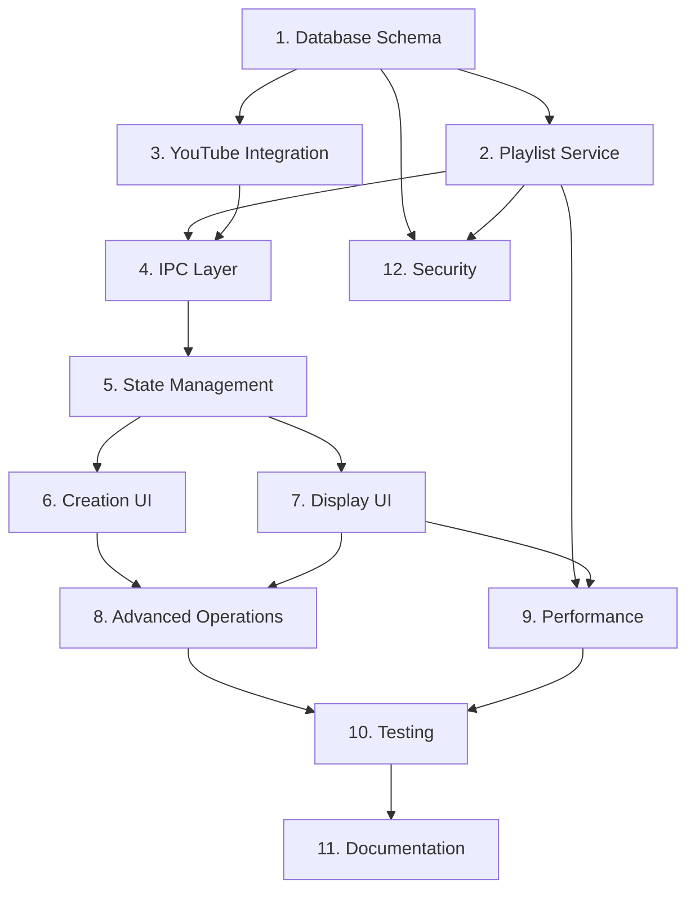

# Implementation Plan: Playlist Management & Local Storage

## Overview

This implementation plan breaks down Phase 2: Playlist Management & Local Storage into discrete, manageable coding tasks that build incrementally upon each other. Each task is designed to be completed independently while contributing to the overall system functionality. The plan prioritizes core functionality first, followed by advanced features and optimizations.

## Implementation Tasks

- [ ] 1. Database Schema and Core Data Layer
  - Set up SQLite database schema for playlists, videos, and relationships
  - Implement database connection and migration system
  - Create base repository classes with CRUD operations
  - Add database indexing for performance optimization
  - _Requirements: 3.1, 3.4, 8.4_

- [ ] 1.1 Create Database Schema Definition
  - Define playlist, video, and junction table schemas using better-sqlite3
  - Implement foreign key constraints and cascading deletes
  - Add indexes for frequently queried columns
  - Create database initialization and migration scripts
  - _Requirements: 3.1, 3.4_

- [ ] 1.2 Implement Base Repository Pattern
  - Create abstract BaseRepository class with common CRUD operations
  - Implement PlaylistRepository with playlist-specific queries
  - Implement VideoRepository with video-specific queries
  - Add transaction support for complex operations
  - _Requirements: 3.1, 3.6, 8.4_

- [ ] 1.3 Add Database Connection Management
  - Implement database connection pooling and lifecycle management
  - Add database health checks and recovery mechanisms
  - Implement backup and restore functionality
  - Create database optimization utilities
  - _Requirements: 3.5, 9.2, 9.6_

- [ ] 2. Core Playlist Service Layer
  - Implement playlist CRUD operations with validation
  - Add business logic for playlist management
  - Create error handling and logging systems
  - Implement data validation and sanitization
  - _Requirements: 1.1, 1.4, 5.1, 9.3_

- [ ] 2.1 Implement Playlist CRUD Service
  - Create PlaylistService class with create, read, update, delete operations
  - Add input validation using Zod schemas
  - Implement duplicate title checking and conflict resolution
  - Add comprehensive error handling with typed errors
  - _Requirements: 1.1, 1.4, 9.3_

- [ ] 2.2 Add Playlist Validation and Business Logic
  - Implement title uniqueness validation across all playlists
  - Add character limit enforcement for titles and descriptions
  - Create playlist metadata management (tags, privacy, statistics)
  - Implement playlist relationship management
  - _Requirements: 1.3, 1.5, 7.1, 7.4_

- [ ] 2.3 Create Error Handling and Recovery System
  - Implement typed error classes for different error scenarios
  - Add retry logic with exponential backoff for transient failures
  - Create error recovery mechanisms for database corruption
  - Implement comprehensive logging with structured data
  - _Requirements: 9.1, 9.2, 9.4, 9.6_

- [ ] 3. YouTube Integration Service
  - Implement yt-dlp wrapper for playlist metadata extraction
  - Add URL validation and preview functionality
  - Create import progress tracking and cancellation
  - Handle various YouTube playlist types and privacy settings
  - _Requirements: 2.1, 2.2, 2.5, 2.6_

- [ ] 3.1 Create YouTube URL Validation Service
  - Implement YouTube URL format validation using regex patterns
  - Add playlist accessibility checking before import
  - Create preview functionality to show playlist metadata
  - Implement rate limiting to prevent API abuse
  - _Requirements: 2.1, 2.2_

- [ ] 3.2 Implement YouTube Metadata Extraction
  - Create yt-dlp wrapper service for playlist metadata fetching
  - Extract playlist information (title, description, video count)
  - Extract individual video metadata (title, duration, thumbnail, etc.)
  - Handle private, unlisted, and deleted videos gracefully
  - _Requirements: 2.3, 2.4_

- [ ] 3.3 Add Import Progress and Error Handling
  - Implement progress tracking for long-running import operations
  - Add cancellation support for import processes
  - Create detailed error reporting for failed imports
  - Implement partial import recovery for interrupted operations
  - _Requirements: 2.5, 2.6, 9.1_

- [ ] 4. IPC Communication Layer
  - Create type-safe IPC handlers for playlist operations
  - Implement event-driven updates for real-time UI synchronization
  - Add request/response validation and error propagation
  - Create IPC channel documentation and testing utilities
  - _Requirements: 5.1, 5.6_

- [ ] 4.1 Implement Core Playlist IPC Handlers
  - Create IPC handlers for playlist CRUD operations
  - Add type-safe request/response interfaces using TypeScript
  - Implement proper error serialization across IPC boundary
  - Add request validation and sanitization
  - _Requirements: 5.1, 5.6_

- [ ] 4.2 Add YouTube Import IPC Handlers
  - Create handlers for YouTube URL validation and preview
  - Implement import initiation and progress tracking handlers
  - Add import cancellation and status query handlers
  - Create event emitters for real-time import updates
  - _Requirements: 2.1, 2.6, 5.1_

- [ ] 4.3 Create Event-Driven Update System
  - Implement event emitters for playlist data changes
  - Add real-time UI synchronization for concurrent operations
  - Create event batching to prevent UI flooding
  - Implement event persistence for offline synchronization
  - _Requirements: 5.1, 5.2, 5.6_

- [ ] 5. Frontend State Management
  - Set up React Query for server state management
  - Implement Zustand stores for client-side UI state
  - Create custom hooks for playlist operations
  - Add optimistic updates and cache management
  - _Requirements: 5.1, 5.2, 5.3, 5.5_

- [ ] 5.1 Configure React Query Setup
  - Set up React Query client with appropriate cache configuration
  - Create query keys factory for consistent cache management
  - Implement query invalidation strategies
  - Add error boundaries and retry logic
  - _Requirements: 5.1, 5.3, 5.5_

- [ ] 5.2 Implement Playlist Query Hooks
  - Create usePlaylist hook for individual playlist fetching
  - Implement usePlaylistList hook with filtering and sorting
  - Add usePlaylistMutations hook for CRUD operations
  - Create useYouTubeImport hook for import operations
  - _Requirements: 5.1, 5.2, 5.3_

- [ ] 5.3 Create UI State Management with Zustand
  - Implement playlist UI store for view preferences and selections
  - Add search and filter state management
  - Create modal and dialog state management
  - Implement persistent UI preferences using localStorage
  - _Requirements: 5.1, 5.2, 5.4_

- [ ] 6. Playlist Creation UI Components
  - Build playlist creation dialog with tabbed interface
  - Implement form validation with real-time feedback
  - Create YouTube import preview functionality
  - Add progress indicators and error handling UI
  - _Requirements: 1.1, 1.6, 2.2, 2.6_

- [ ] 6.1 Create AddPlaylistDialog Component
  - Build modal dialog with tabbed interface (Custom/YouTube)
  - Implement form components with validation feedback
  - Add character counters and input constraints
  - Create responsive design for different screen sizes
  - _Requirements: 1.1, 1.3, 1.6_

- [ ] 6.2 Implement YouTube Import Tab
  - Create URL input with validation and preview
  - Add playlist preview display with metadata
  - Implement import progress indicators
  - Add error handling and retry mechanisms
  - _Requirements: 2.2, 2.6_

- [ ] 6.3 Add Form Validation and User Feedback
  - Implement real-time validation with error messages
  - Add success notifications and confirmation dialogs
  - Create loading states and progress indicators
  - Implement accessibility features (ARIA labels, keyboard navigation)
  - _Requirements: 1.6, 9.3_

- [ ] 7. Playlist Display and Management UI
  - Create responsive playlist grid and list views
  - Implement search, filtering, and sorting functionality
  - Add context menus and batch operations
  - Create playlist detail views with video listings
  - _Requirements: 4.1, 4.2, 4.3, 4.5, 6.1_

- [ ] 7.1 Build PlaylistGrid Component
  - Create responsive grid layout with CSS Grid
  - Implement playlist cards with thumbnails and metadata
  - Add hover effects and interaction states
  - Create empty states and loading skeletons
  - _Requirements: 4.1, 4.2_

- [ ] 7.2 Implement Search and Filter System
  - Create search input with debounced queries
  - Add filter dropdowns for playlist type, tags, and date ranges
  - Implement sorting options (name, date, video count)
  - Create filter persistence and URL state management
  - _Requirements: 4.3, 4.4_

- [ ] 7.3 Add Context Menus and Actions
  - Implement right-click context menus for playlist items
  - Add playlist actions (edit, duplicate, delete, export)
  - Create batch selection and bulk operations
  - Implement keyboard shortcuts for common actions
  - _Requirements: 4.5, 6.1, 6.2_

- [ ] 8. Advanced Playlist Operations
  - Implement playlist duplication and merging
  - Add export functionality in multiple formats
  - Create playlist organization with tags and folders
  - Add playlist statistics and analytics
  - _Requirements: 6.1, 6.2, 6.5, 7.2, 7.4_

- [ ] 8.1 Implement Playlist Duplication
  - Create playlist cloning with unique name generation
  - Add deep copying of playlist metadata and video associations
  - Implement progress tracking for large playlist duplication
  - Add error handling for duplication failures
  - _Requirements: 6.1_

- [ ] 8.2 Add Playlist Export Functionality
  - Implement export to JSON format with full metadata
  - Add CSV export for spreadsheet compatibility
  - Create M3U playlist export for media players
  - Add batch export for multiple playlists
  - _Requirements: 6.2, 10.4_

- [ ] 8.3 Create Playlist Organization System
  - Implement tagging system with autocomplete
  - Add folder-like organization capabilities
  - Create playlist categorization and grouping
  - Implement drag-and-drop organization interface
  - _Requirements: 7.2, 7.3_

- [ ] 9. Performance Optimization
  - Implement virtual scrolling for large playlist collections
  - Add database query optimization and indexing
  - Create efficient caching strategies
  - Implement lazy loading and code splitting
  - _Requirements: 8.1, 8.2, 8.3, 8.5_

- [ ] 9.1 Implement Virtual Scrolling
  - Add virtual scrolling for playlist grids with 1000+ items
  - Implement dynamic item sizing and positioning
  - Create smooth scrolling with momentum and inertia
  - Add keyboard navigation support for virtual lists
  - _Requirements: 8.1, 8.2_

- [ ] 9.2 Optimize Database Performance
  - Add database query profiling and optimization
  - Implement connection pooling and prepared statements
  - Create database maintenance and cleanup routines
  - Add query result caching for frequently accessed data
  - _Requirements: 8.3, 8.4_

- [ ] 9.3 Implement Efficient Caching
  - Create multi-level caching strategy (memory, disk, network)
  - Add cache invalidation and consistency management
  - Implement cache warming for frequently accessed data
  - Create cache metrics and monitoring
  - _Requirements: 8.5, 5.5_

- [ ] 10. Testing and Quality Assurance
  - Create comprehensive unit tests for all services
  - Implement integration tests for YouTube import functionality
  - Add performance tests for large dataset handling
  - Create end-to-end tests for critical user workflows
  - _Requirements: All requirements for quality assurance_

- [ ] 10.1 Write Unit Tests for Core Services
  - Test playlist CRUD operations with edge cases
  - Test YouTube import functionality with mocked responses
  - Test database operations with transaction rollback scenarios
  - Test error handling and recovery mechanisms
  - _Requirements: 1.1, 2.1, 3.1, 9.1_

- [ ] 10.2 Create Integration Tests
  - Test complete YouTube import workflow end-to-end
  - Test database migration and backup/restore functionality
  - Test IPC communication between frontend and backend
  - Test concurrent operations and race condition handling
  - _Requirements: 2.1, 3.1, 5.1, 9.2_

- [ ] 10.3 Implement Performance Tests
  - Test application performance with 1000+ playlists
  - Test search and filter performance with large datasets
  - Test memory usage and garbage collection efficiency
  - Test database query performance under load
  - _Requirements: 8.1, 8.2, 8.3, 8.4_

- [ ] 11. Documentation and Developer Experience
  - Create API documentation for all services and interfaces
  - Write user guides for playlist management features
  - Add inline code documentation and examples
  - Create troubleshooting guides and FAQ
  - _Requirements: Developer productivity and maintainability_

- [ ] 11.1 Write Technical Documentation
  - Document all IPC channels and their interfaces
  - Create database schema documentation with relationships
  - Document error codes and recovery procedures
  - Add code examples and usage patterns
  - _Requirements: Developer productivity_

- [ ] 11.2 Create User Documentation
  - Write user guides for playlist creation and management
  - Create troubleshooting guides for common issues
  - Add FAQ section for YouTube import problems
  - Create video tutorials for complex workflows
  - _Requirements: User experience and support_

- [ ] 12. Security and Data Protection
  - Implement input validation and sanitization
  - Add SQL injection prevention measures
  - Create data encryption for sensitive information
  - Implement secure file handling and permissions
  - _Requirements: Security and data integrity_

- [ ] 12.1 Implement Input Validation
  - Add comprehensive input validation using Zod schemas
  - Implement XSS prevention for user-generated content
  - Add rate limiting for API endpoints
  - Create input sanitization for database operations
  - _Requirements: 9.3, security_

- [ ] 12.2 Add Data Protection Measures
  - Implement database encryption for sensitive data
  - Add secure file storage with proper permissions
  - Create audit logging for data access and modifications
  - Implement data retention and cleanup policies
  - _Requirements: Security and privacy_

## Task Dependencies

## Implementation Guidelines

### Code Quality Standards
- All code must be written in TypeScript with strict type checking
- Minimum 80% test coverage for all services and components
- All functions must have JSDoc documentation
- Follow ESLint and Prettier configurations
- Use meaningful variable and function names

### Performance Requirements
- Database queries must complete within 100ms for typical operations
- UI must remain responsive during long-running operations
- Memory usage must not exceed 500MB for 1000+ playlists
- Search operations must complete within 300ms

### Error Handling Standards
- All errors must be properly typed and categorized
- User-facing errors must have clear, actionable messages
- All operations must be recoverable or provide fallback options
- Critical errors must be logged with sufficient context for debugging

### Testing Requirements
- Unit tests for all service methods and business logic
- Integration tests for all IPC communication
- Performance tests for operations with large datasets
- End-to-end tests for critical user workflows

This implementation plan provides a structured approach to building Phase 2 functionality while maintaining code quality, performance, and reliability standards.