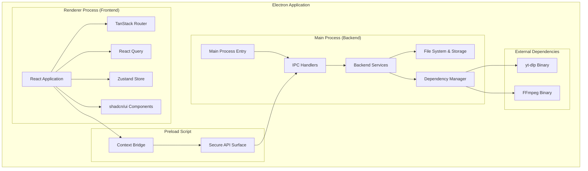

# Design Document: Project Setup & Core Infrastructure

## Overview

This design document outlines the architecture and implementation approach for Phase 1 of the Playlistify application. The focus is on establishing a robust, scalable foundation that will support all future features while maintaining security, performance, and maintainability.

The design follows Electron best practices with a clear separation between the main process (backend) and renderer process (frontend), connected through secure IPC communication. The architecture emphasizes type safety, modern development practices, and automated dependency management.

## Architecture

### High-Level Architecture



### Process Architecture

The application follows Electron's multi-process architecture:

1. **Main Process**: Runs Node.js, manages application lifecycle, handles system operations
2. **Renderer Process**: Runs Chromium, hosts the React application, sandboxed for security
3. **Preload Script**: Secure bridge between processes, exposes controlled API surface

### Security Model

- **Context Isolation**: Enabled to prevent renderer from accessing Node.js globals
- **Node Integration**: Disabled in renderer for security
- **Secure IPC**: All communication through contextBridge with type-safe interfaces
- **Sandboxed Renderer**: Frontend runs in sandboxed environment with limited privileges

## Components and Interfaces

### Core Application Structure

```typescript
// Main Process Entry Point
interface MainProcessConfig {
  window: BrowserWindowOptions;
  security: SecurityConfig;
  ipc: IPCHandlerRegistry;
  services: ServiceRegistry;
}

// Renderer Process Entry Point
interface RendererConfig {
  router: RouterConfig;
  queryClient: QueryClientConfig;
  theme: ThemeConfig;
  store: StoreConfig;
}
```

### IPC Communication Interface

```typescript
// Secure API Surface exposed to renderer
interface ElectronAPI {
  // Application operations
  app: {
    getVersion(): Promise<string>;
    quit(): Promise<void>;
    minimize(): Promise<void>;
    maximize(): Promise<void>;
  };
  
  // File system operations
  fs: {
    selectDirectory(): Promise<string | null>;
    checkFileExists(path: string): Promise<boolean>;
    createDirectory(path: string): Promise<void>;
  };
  
  // Settings management
  settings: {
    get<T>(key: string): Promise<T>;
    set<T>(key: string, value: T): Promise<void>;
    reset(): Promise<void>;
  };
  
  // Future: Playlist operations (Phase 2)
  playlists: {
    // Will be implemented in later phases
  };
  
  // Future: Download operations (Phase 3)
  downloads: {
    // Will be implemented in later phases
  };
}
```

### Service Architecture

```typescript
// Backend Service Registry
interface ServiceRegistry {
  settings: SettingsService;
  fileSystem: FileSystemService;
  dependencyManager: DependencyManagerService;
  logger: LoggerService;
}

// Settings Service Interface
interface SettingsService {
  get<T>(key: string, defaultValue?: T): T;
  set<T>(key: string, value: T): void;
  has(key: string): boolean;
  delete(key: string): void;
  clear(): void;
}

// File System Service Interface
interface FileSystemService {
  ensureDirectory(path: string): Promise<void>;
  copyFile(source: string, destination: string): Promise<void>;
  moveFile(source: string, destination: string): Promise<void>;
  deleteFile(path: string): Promise<void>;
  listDirectory(path: string): Promise<string[]>;
}
```

### Dependency Management System

```typescript
interface DependencyManagerService {
  checkDependencies(): Promise<DependencyStatus>;
  installDependency(name: string): Promise<void>;
  getDependencyPath(name: string): string;
  validateDependency(name: string): Promise<boolean>;
}

interface DependencyStatus {
  ytdlp: {
    installed: boolean;
    version?: string;
    path?: string;
  };
  ffmpeg: {
    installed: boolean;
    version?: string;
    path?: string;
  };
}
```

## Data Models

### Application Configuration

```typescript
interface AppConfig {
  window: {
    width: number;
    height: number;
    minWidth: number;
    minHeight: number;
    center: boolean;
  };
  
  security: {
    nodeIntegration: boolean;
    contextIsolation: boolean;
    enableRemoteModule: boolean;
    webSecurity: boolean;
  };
  
  development: {
    devTools: boolean;
    hotReload: boolean;
    debugLogging: boolean;
  };
}
```

### Settings Schema

```typescript
interface UserSettings {
  // General settings
  theme: 'light' | 'dark' | 'system';
  language: string;
  
  // Directory settings
  downloadLocation: string;
  tempDirectory: string;
  
  // Application behavior
  startMinimized: boolean;
  closeToTray: boolean;
  autoUpdate: boolean;
  
  // Development settings (dev mode only)
  debugMode?: boolean;
  logLevel?: 'error' | 'warn' | 'info' | 'debug';
}
```

### File System Structure

```
AppData/
├── Playlistify/
│   ├── config/
│   │   ├── settings.json
│   │   └── user-preferences.json
│   ├── logs/
│   │   ├── main.log
│   │   └── renderer.log
│   ├── dependencies/
│   │   ├── yt-dlp/
│   │   │   └── bin/
│   │   └── ffmpeg/
│   │       └── bin/
│   └── temp/
```

## Error Handling

### Error Categories

1. **System Errors**: File system, network, dependency issues
2. **Configuration Errors**: Invalid settings, missing configuration
3. **IPC Errors**: Communication failures between processes
4. **Dependency Errors**: Missing or corrupted external tools

### Error Handling Strategy

```typescript
interface ErrorHandler {
  handleSystemError(error: SystemError): void;
  handleConfigError(error: ConfigError): void;
  handleIPCError(error: IPCError): void;
  handleDependencyError(error: DependencyError): void;
}

// Error Recovery Mechanisms
interface ErrorRecovery {
  retryOperation(operation: () => Promise<void>, maxRetries: number): Promise<void>;
  fallbackToDefaults(): void;
  reportError(error: Error, context: string): void;
  gracefulShutdown(): Promise<void>;
}
```

### Logging Strategy

```typescript
interface LoggerConfig {
  level: 'error' | 'warn' | 'info' | 'debug';
  file: {
    enabled: boolean;
    path: string;
    maxSize: number;
    maxFiles: number;
  };
  console: {
    enabled: boolean;
    colorize: boolean;
  };
}
```

## Testing Strategy

### Unit Testing

- **Backend Services**: Test all service methods with mocked dependencies
- **IPC Handlers**: Test request/response cycles with mock data
- **Utility Functions**: Test edge cases and error conditions
- **Configuration**: Test settings validation and defaults

### Integration Testing

- **IPC Communication**: Test full communication flow between processes
- **File System Operations**: Test with temporary directories and files
- **Dependency Management**: Test installation and validation processes
- **Settings Persistence**: Test settings save/load cycles

### End-to-End Testing

- **Application Startup**: Test complete initialization sequence
- **Window Management**: Test window creation, sizing, and lifecycle
- **Error Scenarios**: Test graceful handling of various error conditions
- **Dependency Installation**: Test first-run dependency setup

### Testing Tools

```typescript
// Testing Configuration
interface TestConfig {
  unit: {
    framework: 'jest';
    coverage: {
      threshold: 80;
      exclude: ['**/*.d.ts', '**/node_modules/**'];
    };
  };
  
  integration: {
    framework: 'jest';
    environment: 'electron';
    timeout: 30000;
  };
  
  e2e: {
    framework: 'playwright';
    browsers: ['electron'];
    headless: boolean;
  };
}
```

## Performance Considerations

### Startup Performance

- **Lazy Loading**: Load non-critical services after main window appears
- **Dependency Caching**: Cache dependency status to avoid repeated checks
- **Parallel Initialization**: Initialize independent services concurrently
- **Resource Optimization**: Minimize initial bundle size

### Memory Management

- **Service Lifecycle**: Properly dispose of services and event listeners
- **IPC Cleanup**: Remove IPC handlers when no longer needed
- **File Handle Management**: Ensure proper cleanup of file operations
- **Memory Monitoring**: Track memory usage in development

### Build Optimization

```typescript
interface BuildOptimization {
  webpack: {
    splitChunks: boolean;
    treeShaking: boolean;
    minification: boolean;
    sourceMap: 'development' | 'production';
  };
  
  electron: {
    asar: boolean;
    compression: 'gzip' | 'brotli';
    excludeNodeModules: string[];
  };
}
```

## Security Considerations

### Process Isolation

- **Sandboxed Renderer**: Prevent direct system access from frontend
- **Controlled IPC**: Whitelist allowed operations and validate inputs
- **Context Bridge**: Secure API surface with type checking
- **CSP Headers**: Content Security Policy for web content

### File System Security

- **Path Validation**: Sanitize and validate all file paths
- **Permission Checks**: Verify file system permissions before operations
- **Temporary Files**: Secure handling and cleanup of temporary files
- **User Data Protection**: Encrypt sensitive user data

### Dependency Security

- **Signature Verification**: Verify downloaded dependency signatures
- **Isolated Installation**: Install dependencies in controlled locations
- **Version Pinning**: Use specific versions to prevent supply chain attacks
- **Regular Updates**: Monitor and update dependencies for security patches

## Deployment Strategy

### Development Environment

```bash
# Development setup
npm install
npm run setup:deps
npm run dev

# Testing
npm run test
npm run test:integration
npm run test:e2e

# Linting and formatting
npm run lint
npm run format
```

### Production Build

```bash
# Production build
npm run build
npm run package

# Platform-specific builds
npm run package:windows
npm run package:macos
npm run package:linux
```

### Distribution

- **Auto-updater**: Electron-updater for seamless updates
- **Code Signing**: Sign applications for security and trust
- **Installer Creation**: Platform-specific installers
- **Update Channels**: Stable, beta, and alpha release channels

This design provides a solid foundation for the Playlistify application, ensuring security, maintainability, and scalability for future feature development.