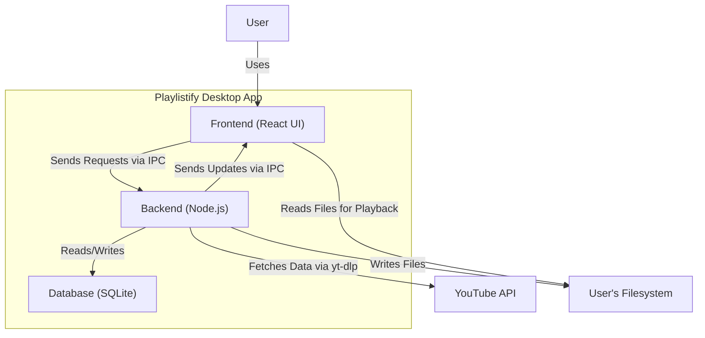
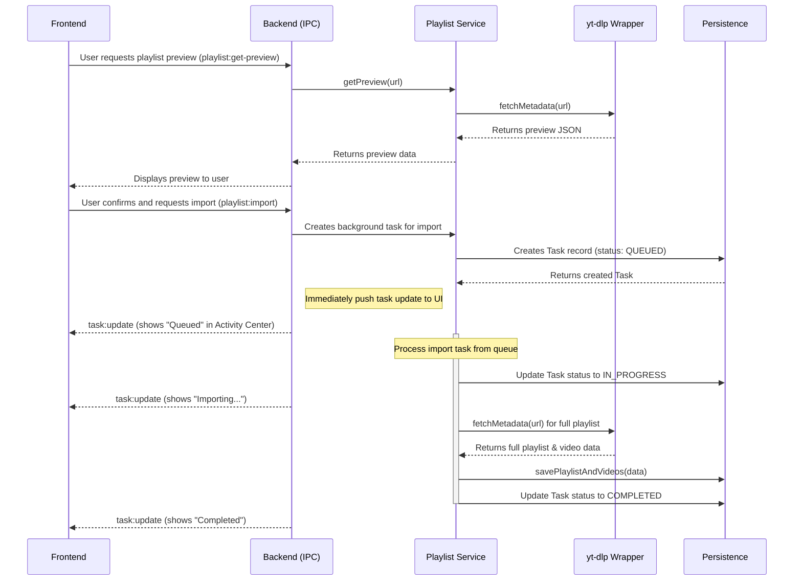
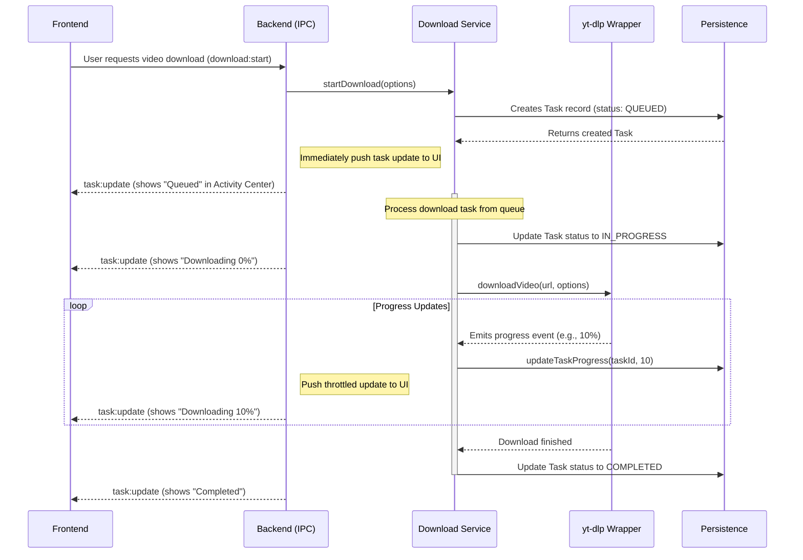

# Playlistify Architecture Document

## Introduction / Preamble

This document outlines the overall project architecture for the Playlistify desktop application. Its primary goal is to serve as the guiding architectural blueprint for development, ensuring consistency and adherence to chosen patterns and technologies. Given the monolithic nature of this Electron application, this single document will cover both backend and frontend concerns.

## Technical Summary

The Playlistify application will be a cross-platform desktop application built using the Electron platform. It will be architected as a monolith within a single monorepo. The system is comprised of two main parts: a Node.js backend process responsible for all core business logic, data persistence using SQLite, and interaction with external services like `yt-dlp`; and a React frontend process for the user interface. The primary architectural goal is to support the vision of providing a powerful, stable, and secure tool for users to manage, archive, and locally access their YouTube content.

## High-Level Overview

The Playlistify application is designed as a **Monolith** contained within a single **Monorepo**. This approach simplifies development, building, and testing for a self-contained desktop application. The architecture is based on Electron's two-process model:

* **Main Process (Backend):** A Node.js environment with full access to the operating system. It is responsible for all business logic, window management, interaction with the filesystem, database operations (SQLite), and invoking external services like `yt-dlp` to fetch data from YouTube.
* **Renderer Process (Frontend):** A Chromium environment responsible for rendering the user interface using React. It is sandboxed and communicates with the Main process via Electron's Inter-Process Communication (IPC) bridge to request data or trigger backend actions.

The primary data flow is as follows: The user interacts with the React UI, which sends requests (e.g., "import playlist," "download video") over an IPC channel. The Node.js backend processes these requests, fetches data from YouTube, updates the SQLite database, manages background tasks, and sends results or real-time status updates back to the UI to be displayed to the user.



## Architectural / Design Patterns Adopted

* **IPC-Driven Communication**
    * **Rationale:** This is a fundamental pattern for Electron applications. The sandboxed Frontend (Renderer Process) will communicate with the privileged Backend (Main Process) via asynchronous Inter-Process Communication (IPC) channels. The backend will expose specific "handler" functions to be invoked by the frontend for all data queries and actions.
* **Background Worker & Task Queue**
    * **Rationale:** To ensure the UI remains responsive during long-running operations like video downloads and playlist imports, all such tasks will be managed by a dedicated background worker system. We will use the `p-queue` library to manage a low-concurrency queue, preventing system overload and providing robust control over background jobs as detailed in Epic 4.
* **Repository Pattern**
    * **Rationale:** To abstract and centralize all database interactions. We will create a "repository" for each data entity (e.g., `PlaylistRepository`, `VideoRepository`, `TaskRepository`). This decouples the business logic from the `better-sqlite3` data-access implementation, making the application easier to test, maintain, and reason about.
* **Separated State Management (Server vs. UI State)**
    * **Rationale:** We will adopt a modern React state management strategy using the selected libraries to handle two distinct types of state:
        * **Server State (`TanStack React Query`):** Used for fetching, caching, and synchronizing data that originates from the backend, such as playlist contents or download statuses. It simplifies data fetching and eliminates the need for manual loading/error state management in many components.
        * **Global UI State (`Zustand`):** Used for client-side state that is shared across many components but does not represent data from the backend. Examples include the visibility of the Activity Center, the state of the active media player, or theme/UI preferences.

## Component View

The Playlistify application, while monolithic, is composed of several distinct logical components that collaborate to deliver the required functionality.

```mermaid
graph TD
    subgraph Frontend (Renderer Process)
        A["UI Components (React)"]
    end

    subgraph Backend (Main Process)
        B["IPC Service"]
        C["Playlist Service"]
        D["Download & Task Management Service"]
        E["Health Check Service"]
        F["Persistence Service (Repositories)"]
        G["External Tool Wrappers"]
    end
    
    H[("SQLite Database")]
    I[("User's Filesystem")]
    J[("YouTube")]

    A -- "User Input / Requests" --> B
    B -- "Data / Events" --> A
    B --> C
    B --> D
    B --> E
    C -- "Uses" --> F
    D -- "Uses" --> F
    E -- "Uses" --> F
    C -- "Uses" --> G
    D -- "Uses" --> G
    E -- "Uses" --> G
    F -- "Reads/Writes" --> H
    D -- "Writes/Reads Files" --> I
    A -- "Plays Files From" --> I
    G -- "Calls" --> J
```

* **UI Components (Frontend)**
    * **Responsibility:** Renders the entire user interface using React and `shadcn/ui` components. It captures all user input and sends requests to the backend via the IPC Service. It is responsible for displaying data and real-time updates received from the backend. Key components include the `Dashboard`, `PlaylistDetailsView`, `ActivityCenter`, and `VideoPlayer`.
* **IPC Service (Backend)**
    * **Responsibility:** Acts as the secure communication bridge between the Frontend and Backend. It defines all the available channels and data contracts, exposing backend services to the UI in a controlled manner.
* **Playlist Service (Backend)**
    * **Responsibility:** Manages the logic for importing, creating, and modifying playlists. It orchestrates calls to the `yt-dlp` wrapper to fetch metadata from YouTube and uses the Persistence Service to save the information.
* **Download & Task Management Service (Backend)**
    * **Responsibility:** Handles the entire lifecycle of long-running tasks, primarily video downloads. It manages the `p-queue` to control concurrency, tracks the status of all tasks in the database (via the Persistence Service), and uses the `yt-dlp` and `ffmpeg` wrappers to download and process media files.
* **Health Check Service (Backend)**
    * **Responsibility:** Implements the playlist health and status sync functionality described in Epic 5. It runs scheduled or manually triggered checks on imported playlists to verify video availability, managing its own low-concurrency queue to avoid rate-limiting.
* **Persistence Service (Repositories) (Backend)**
    * **Responsibility:** Implements the Repository Pattern for all database interactions. It contains classes like `PlaylistRepository` and `VideoRepository` that abstract all `better-sqlite3` CRUD operations, providing a clean data access API to the other backend services.
* **External Tool Wrappers (Backend)**
    * **Responsibility:** A layer of abstraction around command-line tools. This isolates the core application logic from the specifics of invoking and parsing the output from `yt-dlp-wrap` and `fluent-ffmpeg`.

## Project Structure

```plaintext
playlistify-app/
├── release/              # Packaged application output (git-ignored)
├── assets/               # Static assets like icons for the app installer/builder
└── src/                  # Main source code directory
    ├── backend/          # Backend - Electron Main Process code (Node.js)
    │   ├── db/           # Database schema (schema.sql) and setup scripts
    │   ├── lib/          # Wrappers for external tools (yt-dlp, ffmpeg)
    │   ├── repositories/ # Data access layer (e.g., PlaylistRepository.ts)
    │   ├── services/     # Core backend services (Playlist, Download, HealthCheck)
    │   └── main.ts       # Entry point for the Main Process
    │
    ├── frontend/         # Frontend - Electron Renderer Process code (React)
    │   ├── components/   # Shared/reusable React components
    │   ├── hooks/        # Custom React hooks
    │   ├── lib/          # Frontend-specific utilities
    │   ├── pages/        # Top-level page components (Dashboard, Settings, etc.)
    │   ├── store/        # Zustand state management store
    │   └── index.tsx     # Entry point for the Renderer Process
    │
    └── shared/             # Code shared between Backend and Frontend processes
        ├── ipc-contracts.ts # TypeScript types for IPC communication
        └── types.ts         # Other shared type definitions
```

### Key Directory Descriptions

* **`src/backend`**: Contains all backend logic. This code runs in Node.js and has access to the operating system, filesystem, and database.
* **`src/frontend`**: Contains all frontend UI code. This code runs in a sandboxed Chromium window and is responsible for everything the user sees and interacts with.
* **`src/shared`**: A crucial directory for holding TypeScript types and definitions that are used by *both* the backend and frontend to ensure they communicate correctly.

## API Reference

### External APIs Consumed

The application does not directly consume a traditional REST/HTTP API for YouTube. Instead, it interacts with YouTube's services through a command-line wrapper.

#### yt-dlp-wrap

* **Purpose:** To fetch all playlist/video metadata, list available download formats, and retrieve media streams from YouTube without requiring a direct API key. This wrapper will be invoked by our `backend/lib/` wrappers.
* **Authentication:** Not applicable (uses public-facing data).
* **Key "Endpoints" (Commands):**
    * `yt-dlp --dump-json [URL]`: Used by the Playlist Service to get all available metadata for a given playlist or video URL.
    * `yt-dlp --list-formats [URL]`: Used by the Download Service to get all available video/audio quality formats before starting a download.
    * `yt-dlp --get-status [URL]`: Used by the Health Check service to verify video availability (`Live`, `Deleted`, `Private`).
    * `yt-dlp -f [format] -o [output_path] [URL]`: Used by the Download Service to download the actual video/audio stream to the user's filesystem.

### Internal APIs Provided

This is the contract for the Inter-Process Communication (IPC) between our `frontend` and `backend`. The frontend sends a message on a specific channel, and the backend listens and responds.

#### Playlistify IPC API

* **Purpose:** To allow the sandboxed `frontend` to securely request data and trigger actions on the `backend`.
* **Authentication/Authorization:** Not applicable. The security model is the Electron process sandbox.
* **Endpoints (IPC Channels):**
    * **Request/Response Channels (Frontend invokes, Backend responds):**
        * `playlist:get-preview` (Args: `url: string`): Fetches preview metadata for a given YouTube URL.
        * `playlist:import` (Args: `url: string`): Starts the background task to import a full public playlist.
        * `playlist:create-custom` (Args: `{title: string, description: string}`): Creates a new custom playlist.
        * `download:get-quality-options` (Args: `url: string`): Gets available download quality options for a video.
        * `download:start` (Args: `DownloadOptions`): Initiates a download task for a single video or a full playlist.
        * `task:cancel` (Args: `taskId: string`): Requests cancellation of an active background task.
        * `healthcheck:start-manual` (Args: `playlistId: string`): Manually triggers a health check for a specific playlist.
    * **Push Channels (Backend sends, Frontend listens):**
        * `task:update` (Data: `Task[]`): The backend will periodically push the full list of active tasks to the frontend to update the Activity Center UI in real-time.

## Data Models

### Core Application Entities / Domain Objects

These are the primary data structures used throughout the application, defined here as TypeScript interfaces.

#### Playlist

* **Description:** Represents a collection of videos, which can either be imported from YouTube or created custom by the user.
* **Schema / Interface Definition:**
    ```typescript
    export interface Playlist {
      id: string; // Unique identifier (UUID)
      type: 'YOUTUBE' | 'CUSTOM';
      title: string;
      description?: string;
      youtubeId?: string; // Original YouTube playlist ID, if type is 'YOUTUBE'
      thumbnailUrl?: string;
      lastHealthCheck?: string; // ISO 8601 timestamp
      createdAt: string; // ISO 8601 timestamp
    }
    ```
* **Validation Rules:** `title` is required and cannot be empty.

#### Video

* **Description:** Represents a single video, containing its metadata and status within the user's library.
* **Schema / Interface Definition:**
    ```typescript
    export interface Video {
      id: string; // Unique identifier (UUID)
      youtubeId: string; // Original YouTube video ID
      title: string;
      channelName: string;
      duration: number; // in seconds
      thumbnailUrl?: string;
      viewCount?: number;
      uploadDate?: string; // ISO 8601 timestamp
      availabilityStatus: 'LIVE' | 'DELETED' | 'PRIVATE' | 'UNLISTED' | 'UNCHECKED';
      downloadPath?: string; // Local file path if downloaded
      downloadQuality?: string; // e.g., '1080p'
      downloadedAt?: string; // ISO 8601 timestamp
    }
    ```
* **Validation Rules:** `youtubeId` and `title` are required.

#### BackgroundTask

* **Description:** Represents a long-running background task, such as an import or download.
* **Schema / Interface Definition:**
    ```typescript
    export interface BackgroundTask {
      id: string; // Unique identifier (UUID)
      type: 'IMPORT' | 'DOWNLOAD' | 'HEALTH_CHECK';
      status: 'QUEUED' | 'IN_PROGRESS' | 'COMPLETED' | 'FAILED' | 'COMPLETED_WITH_ERRORS' | 'CANCELLED';
      progress: number; // 0-100
      message?: string; // e.g., "Downloading video 5 of 20" or error details
      targetId: string; // ID of the playlist or video this task relates to
      parentId?: string; // For parent/child task relationships
      createdAt: string; // ISO 8601 timestamp
      completedAt?: string; // ISO 8601 timestamp
    }
    ```

### API Payload Schemas (If distinct)

For now, most IPC API payloads will directly use the Core Application Entities or simple primitives (e.g., `{ url: string }`). Distinct Data Transfer Objects (DTOs) will be defined in `src/shared/ipc-contracts.ts` as they become necessary.

### Database Schemas

The following SQL statements define the tables for our `better-sqlite3` database.

#### `playlists` table

* **Purpose:** Stores all imported and custom playlists.
* **Schema Definition:**
    ```sql
    CREATE TABLE playlists (
      id TEXT PRIMARY KEY,
      type TEXT NOT NULL, -- 'YOUTUBE' or 'CUSTOM'
      title TEXT NOT NULL,
      description TEXT,
      youtube_id TEXT UNIQUE,
      thumbnail_url TEXT,
      last_health_check TEXT,
      created_at TEXT NOT NULL
    );
    ```

#### `videos` table

* **Purpose:** Stores metadata for all unique videos across all playlists.
* **Schema Definition:**
    ```sql
    CREATE TABLE videos (
      id TEXT PRIMARY KEY,
      youtube_id TEXT NOT NULL UNIQUE,
      title TEXT NOT NULL,
      channel_name TEXT,
      duration INTEGER,
      thumbnail_url TEXT,
      view_count INTEGER,
      upload_date TEXT,
      availability_status TEXT NOT NULL DEFAULT 'UNCHECKED',
      download_path TEXT,
      download_quality TEXT,
      downloaded_at TEXT
    );
    ```

#### `playlist_videos` table

* **Purpose:** A junction table to manage the many-to-many relationship between playlists and videos.
* **Schema Definition:**
    ```sql
    CREATE TABLE playlist_videos (
      playlist_id TEXT NOT NULL,
      video_id TEXT NOT NULL,
      PRIMARY KEY (playlist_id, video_id),
      FOREIGN KEY (playlist_id) REFERENCES playlists(id) ON DELETE CASCADE,
      FOREIGN KEY (video_id) REFERENCES videos(id) ON DELETE CASCADE
    );
    ```

#### `background_tasks` table

* **Purpose:** Stores the state of all background tasks for persistence.
* **Schema Definition:**
    ```sql
    CREATE TABLE background_tasks (
      id TEXT PRIMARY KEY,
      type TEXT NOT NULL,
      status TEXT NOT NULL,
      progress INTEGER DEFAULT 0,
      message TEXT,
      target_id TEXT,
      parent_id TEXT,
      created_at TEXT NOT NULL,
      completed_at TEXT,
      FOREIGN KEY (parent_id) REFERENCES background_tasks(id) ON DELETE CASCADE
    );
    ```

## Core Workflow / Sequence Diagrams

### Workflow 1: Import New YouTube Playlist

This diagram illustrates the process from when a user pastes a URL to when the playlist is fully imported into the application.



### Workflow 2: Download a Single Video

This diagram shows the steps for downloading a video, including real-time progress updates to the UI.



## Definitive Tech Stack Selections

This table outlines the definitive technology choices for the project, based on the requirements in the PRD and the specific libraries you provided.

| Category | Technology | Version / Details | Description / Purpose |
| :--- | :--- | :--- | :--- |
| **Languages** | TypeScript | v5.3.3 | Primary language for frontend and backend. |
| **Runtime** | Electron | v28.2.3 | Cross-platform desktop application runtime. |
| **Frameworks** | React | v18.2.0 | Frontend UI library. |
| **Databases** | Better-SQLite3 | v11.9.1 | Local relational data store. |
| **State Management** | Zustand | v5.0.3 | Global state management for React. |
| **Data Fetching** | TanStack React Query| v5.71.10 | Server state management and data fetching. |
| **Routing** | TanStack React Router| v1.114.34 | Client-side routing for the application. |
| **UI Libraries**| shadcn/ui | v0.0.4 | Primary component library. |
| | Lucide React | v0.487.0 | Icon library. |
| **Styling**| Tailwind CSS | v3.4.1 | Utility-first CSS framework. |
| **Backend Tools** | yt-dlp-wrap | v2.3.12 | Wrapper for YouTube downloads & metadata. |
| | P-Queue | v8.1.0 | Manages concurrency for background tasks. |
| | Winston | v3.17.0 | Structured logging library. |
| | Fluent-FFmpeg| v2.1.3 | Media processing and thumbnail embedding. |
| **Storage** | Electron Store| v10.0.1 | Persistent key-value settings storage. |
| **Testing** | Jest | v29.7.0 | Primary testing framework. |
| | React Testing Library | v14.3.1 | Utilities for testing React components. |

## Infrastructure and Deployment Overview

* **Cloud Provider(s):** The application itself runs locally on the user's machine and does not require a cloud provider for its core functionality. **GitHub Releases** will be used as the "cloud provider" for hosting application installers and distributing automatic updates.
* **Core Services Used:**
    * **External:** YouTube (for metadata and media streams, accessed via `yt-dlp-wrap`).
    * **Deployment:** GitHub Actions (for CI/CD) and GitHub Releases (for hosting).
* **Infrastructure as Code (IaC):** Not applicable, as the primary infrastructure is the user's local machine.
* **Deployment Strategy:**
    * **Tools:** We will use **GitHub Actions** for Continuous Integration and Continuous Deployment (CI/CD). The build and packaging process will be managed by **Electron Forge**, which will create installers for Windows (`.exe`), macOS (`.dmg`/`.zip`), and Linux (`.deb`/`.rpm`).
    * **Process:**
        1.  A push to the `main` branch or the creation of a version tag (e.g., `v1.0.1`) will trigger a GitHub Action workflow.
        2.  The workflow will install dependencies, run linter checks, and execute all automated tests.
        3.  If all checks pass, `electron-forge` will build the installers for all target platforms (Windows, macOS, Linux).
        4.  These installers will be uploaded to a new draft release on GitHub.
        5.  Once the release is published on GitHub, the **`electron-updater`** package built into the application will automatically check for this new version and prompt users to install the update.
* **Environments:**
    * **Development:** The local developer machine running from the source code.
    * **Production:** The packaged and signed application that is released to end-users.
* **Rollback Strategy:** A direct "rollback" is not possible for a distributed desktop application, as users control the version they have installed. The strategy for addressing bugs in a production release is to **roll forward** by releasing a new, patched version as quickly as possible through the established deployment pipeline.

## Error Handling Strategy

* **General Approach:** We will use custom `Error` classes that extend the native `Error` object to provide specific context. For example, `new YTDLPError()` or `new DatabaseError()`. This allows our services to catch and handle different types of errors appropriately. Unhandled exceptions in the backend process will be caught by a global handler, which will log the fatal error and gracefully shut down the application to prevent an unknown state.
* **Logging:**
    * **Library/Method:** All logging will be handled by **Winston**, as specified in our tech stack.
    * **Format:** Logs will be written in a structured **JSON** format to a file in the user's application data directory. This allows for easier parsing and analysis.
    * **Levels:** We will use standard logging levels:
        * `error`: For fatal errors or exceptions that disrupt functionality (e.g., database connection failure, unhandled exceptions).
        * `warn`: For non-critical issues that should be noted (e.g., a video in a playlist health check was not found, a smart quality fallback was used).
        * `info`: For significant application lifecycle events (e.g., Application starting, download task completed, playlist imported).
        * `debug`: For detailed diagnostic information used during development.
    * **Context:** Log entries will include a timestamp, level, message, and a metadata object. We will **never** log sensitive user data or API keys.
* **Specific Handling Patterns:**
    * **External Tool Calls (`yt-dlp`, `ffmpeg`):** Any non-zero exit code or error output from these wrapped tools will be caught and thrown as a specific `ExternalToolError`. For background tasks, this will update the task's status to `FAILED` and store the error message in the database for the user to see.
    * **User-Facing Errors:** When a backend operation fails due to user input (e.g., invalid URL), the backend will send a specific, user-friendly error message back to the frontend via an IPC channel. The frontend will then display this message in a dialog or toast notification.
    * **Database Transactions:** All multi-step database writes (e.g., adding a playlist and all its associated videos) will be wrapped in a `better-sqlite3` transaction. If any step in the process fails, the entire transaction will be rolled back automatically, ensuring data integrity.

## Coding Standards

* **Style Guide & Linter:** The project will use **ESLint** and **Prettier** to enforce a consistent code style. The configurations in `eslint.config.js` and `.prettierrc` are the single source of truth for styling rules and must be adhered to.
* **Naming Conventions:**
    * Variables & Functions: `camelCase`
    * Classes, Types, Interfaces, React Components: `PascalCase`
    * Constants: `UPPER_SNAKE_CASE`
    * Files: `PascalCase.tsx` for React components; `kebab-case.ts` for services, repositories, and other modules.
* **File Structure:** All new files must be placed in the appropriate directory as defined in the **Project Structure** section.
* **Unit Test File Organization:** Unit test files must be named `*.test.ts` or `*.spec.ts` and co-located with the source file they are testing.
* **Asynchronous Operations:** `async/await` must be used for all promise-based asynchronous operations. Direct use of `.then()`/`.catch()` should be limited to cases where `async/await` is not feasible.
* **Type Safety:**
    * TypeScript's `strict` mode must be enabled in `tsconfig.json`.
    * The use of the `any` type is strongly discouraged and requires explicit justification in a code comment.
* **Comments & Documentation:**
    * Comments should explain the *why* behind complex or non-obvious code, not the *what*.
    * TSDoc format must be used for documenting all exported functions, classes, and types.
* **Dependency Management:**
    * Dependencies are managed via `package.json`.
    * Adding new third-party dependencies requires a brief review to assess their necessity, maintenance status, and security posture.
* **Detailed Language Conventions (TypeScript/Node.js):**
    * **Modules:** ESModules (`import`/`export`) must be used exclusively.
    * **Null Handling:** `strictNullChecks` must be enabled. Use optional chaining (`?.`) and nullish coalescing (`??`) to safely handle `null` and `undefined` values.
    * **Immutability:** Prefer immutable data structures. Avoid direct mutation of state objects and props.

## Overall Testing Strategy

* **Tools:**
    * **Unit/Integration Testing:** **Jest**
    * **Component Testing:** **React Testing Library**
    * **End-to-End (E2E) Testing:** **Playwright**
* **Unit Tests:**
    * **Scope:** Test individual functions, React components, and backend service methods in complete isolation.
    * **Location:** Test files will be named `*.test.ts` or `*.spec.ts` and co-located with the source files they test.
    * **Mocking:** All external dependencies (e.g., IPC calls, database repositories, `yt-dlp` wrappers) must be mocked using Jest's built-in mocking capabilities.
    * **Responsibility:** The developer agent is required to generate unit tests covering all significant logic paths, edge cases, and error conditions for any new or modified code.
* **Integration Tests:**
    * **Scope:** Test the interactions between backend services and the database layer. For example, verifying that calling `PlaylistService.importPlaylist` results in the correct data being written to the database.
    * **Location:** These tests will reside in a dedicated `src/backend/__tests__/integration/` directory.
    * **Environment:** Integration tests will run against a separate, temporary file-based SQLite database that is created and seeded before the test run and deleted afterward to ensure full isolation.
* **End-to-End (E2E) Tests:**
    * **Scope:** Test critical user flows from start to finish through the UI. Key flows to cover include: 1) Importing a playlist from URL, 2) Downloading a video, 3) Creating a custom playlist and adding a video to it.
    * **Responsibility:** E2E tests will be created to validate the acceptance criteria of major user stories and epics.
* **Test Coverage:** We will aim for high coverage (>80%) on critical backend services and business logic. However, the primary focus will be on the quality and effectiveness of tests rather than a strict percentage.

## Security Best Practices

* **Input Sanitization & Validation:**
    * All data crossing the IPC bridge from the `frontend` to the `backend` **must** be validated on the `backend` using **Zod** schemas. No data should be trusted or processed before successful validation.
    * Downloaded video titles and other external metadata used for filenames **must** be sanitized to remove invalid characters and prevent path traversal vulnerabilities.
* **Output Encoding (XSS Prevention):**
    * We will rely on React's native JSX encoding to prevent Cross-Site Scripting (XSS) attacks. Direct DOM manipulation (e.g., using `dangerouslySetInnerHTML`) is forbidden unless explicitly reviewed and approved for a specific, necessary use case.
* **Secrets Management:**
    * The application must not contain any hardcoded secrets (API keys, tokens, etc.).
    * User settings and non-sensitive configuration will be managed by `electron-store`. For any future features requiring sensitive tokens (like Google OAuth in the post-MVP phase), they must be stored securely using the operating system's keychain via libraries like `electron-keytar`.
* **Electron Process Security:**
    * **Principle of Least Privilege:** The frontend (Renderer Process) **must** be sandboxed (`sandbox: true`). All access to the filesystem, OS-level APIs, or spawning child processes (`yt-dlp`) **must** be performed exclusively by the `backend` (Main Process).
    * **Context Isolation:** `contextIsolation` must be enabled to prevent frontend code from directly accessing Node.js APIs in the backend. All communication must occur through a preload script that exposes a secure IPC bridge.
* **Dependency Security:**
    * The CI/CD pipeline in GitHub Actions must include a step to run `npm audit` or a similar vulnerability scanner.
    * High or critical severity vulnerabilities must be addressed before a new version can be released.
* **Error Handling & Information Disclosure:**
    * As defined in our Error Handling Strategy, detailed error messages or stack traces must never be exposed to the user in the UI. They should be logged securely in the backend, and a generic error message or reference ID should be presented to the user.
