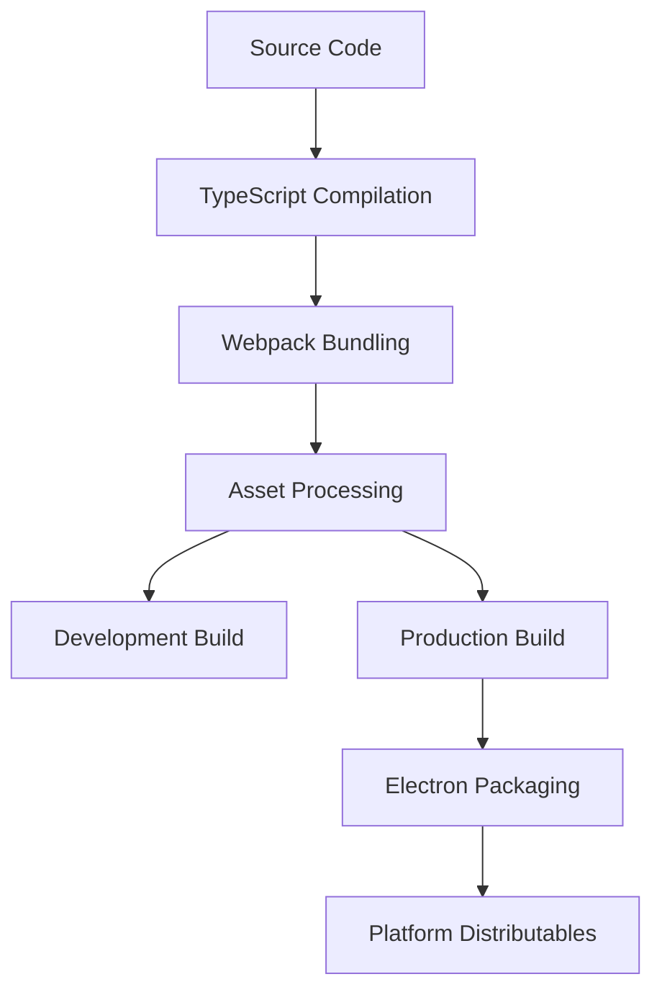

# Build Process Documentation

This document describes the build process, configuration, and deployment pipeline for Playlistify.

## Build Overview

Playlistify uses a multi-stage build process that handles:
- TypeScript compilation
- Webpack bundling for main, renderer, and preload processes
- Asset processing and optimization
- Electron packaging and distribution

## Build Architecture



## Build Configuration

### Webpack Configuration

#### Main Process (`webpack.main.config.js`)

```javascript
const path = require('path');

module.exports = {
  entry: './src/main.ts',
  target: 'electron-main',
  mode: process.env.NODE_ENV || 'development',
  module: {
    rules: [
      {
        test: /\.ts$/,
        use: 'ts-loader',
        exclude: /node_modules/,
      },
    ],
  },
  resolve: {
    extensions: ['.ts', '.js'],
    alias: {
      '@': path.resolve(__dirname, 'src'),
    },
  },
  output: {
    path: path.resolve(__dirname, 'dist'),
    filename: 'main.js',
  },
};
```

#### Renderer Process (`webpack.renderer.config.js`)

```javascript
const path = require('path');
const HtmlWebpackPlugin = require('html-webpack-plugin');

module.exports = {
  entry: './src/renderer.tsx',
  target: 'electron-renderer',
  mode: process.env.NODE_ENV || 'development',
  module: {
    rules: [
      {
        test: /\.tsx?$/,
        use: 'ts-loader',
        exclude: /node_modules/,
      },
      {
        test: /\.css$/,
        use: ['style-loader', 'css-loader', 'postcss-loader'],
      },
      {
        test: /\.(png|jpe?g|gif|svg)$/,
        type: 'asset/resource',
      },
    ],
  },
  resolve: {
    extensions: ['.tsx', '.ts', '.js'],
    alias: {
      '@': path.resolve(__dirname, 'src'),
    },
  },
  plugins: [
    new HtmlWebpackPlugin({
      template: './src/index.html',
    }),
  ],
  output: {
    path: path.resolve(__dirname, 'dist'),
    filename: 'renderer.js',
  },
};
```

#### Preload Script (`webpack.preload.config.js`)

```javascript
const path = require('path');

module.exports = {
  entry: './src/preload.ts',
  target: 'electron-preload',
  mode: process.env.NODE_ENV || 'development',
  module: {
    rules: [
      {
        test: /\.ts$/,
        use: 'ts-loader',
        exclude: /node_modules/,
      },
    ],
  },
  resolve: {
    extensions: ['.ts', '.js'],
  },
  output: {
    path: path.resolve(__dirname, 'dist'),
    filename: 'preload.js',
  },
};
```

### TypeScript Configuration

#### Main Config (`tsconfig.json`)

```json
{
  "compilerOptions": {
    "target": "ES2020",
    "module": "commonjs",
    "lib": ["ES2020", "DOM"],
    "outDir": "./dist",
    "rootDir": "./src",
    "strict": true,
    "esModuleInterop": true,
    "skipLibCheck": true,
    "forceConsistentCasingInFileNames": true,
    "resolveJsonModule": true,
    "declaration": true,
    "declarationMap": true,
    "sourceMap": true,
    "baseUrl": ".",
    "paths": {
      "@/*": ["src/*"],
      "@/frontend/*": ["src/frontend/*"],
      "@/backend/*": ["src/backend/*"],
      "@/shared/*": ["src/shared/*"]
    }
  },
  "include": ["src/**/*"],
  "exclude": ["node_modules", "dist", "tests"]
}
```

### PostCSS Configuration

```javascript
module.exports = {
  plugins: {
    tailwindcss: {},
    autoprefixer: {},
    ...(process.env.NODE_ENV === 'production' ? { cssnano: {} } : {}),
  },
};
```

### Electron Forge Configuration

```javascript
module.exports = {
  packagerConfig: {
    name: 'Playlistify',
    executableName: 'playlistify',
    icon: './assets/icons/app/icon',
    extraResource: ['./assets'],
    ignore: [
      /^\/src/,
      /^\/tests/,
      /^\/docs/,
      /(.eslintrc|.gitignore|.prettierrc)/,
    ],
  },
  rebuildConfig: {},
  makers: [
    {
      name: '@electron-forge/maker-squirrel',
      config: {
        name: 'Playlistify',
      },
    },
    {
      name: '@electron-forge/maker-zip',
      platforms: ['darwin'],
    },
    {
      name: '@electron-forge/maker-deb',
      config: {},
    },
    {
      name: '@electron-forge/maker-rpm',
      config: {},
    },
  ],
  plugins: [
    {
      name: '@electron-forge/plugin-webpack',
      config: {
        mainConfig: './webpack.main.config.js',
        renderer: {
          config: './webpack.renderer.config.js',
          entryPoints: [
            {
              html: './src/index.html',
              js: './src/renderer.tsx',
              name: 'main_window',
              preload: {
                js: './src/preload.ts',
              },
            },
          ],
        },
      },
    },
  ],
};
```

## Build Scripts

### Package.json Scripts

```json
{
  "scripts": {
    "dev": "electron-forge start",
    "build": "npm run build:main && npm run build:renderer && npm run build:preload",
    "build:main": "webpack --config webpack.main.config.js",
    "build:renderer": "webpack --config webpack.renderer.config.js",
    "build:preload": "webpack --config webpack.preload.config.js",
    "build:prod": "NODE_ENV=production npm run build",
    "package": "electron-forge package",
    "make": "electron-forge make",
    "publish": "electron-forge publish",
    "lint": "eslint src/ --ext .ts,.tsx",
    "lint:fix": "eslint src/ --ext .ts,.tsx --fix",
    "format": "prettier --write \"src/**/*.{ts,tsx,css,md}\"",
    "type-check": "tsc --noEmit",
    "clean": "rimraf dist/ .webpack/",
    "prebuild": "npm run clean && npm run type-check && npm run lint"
  }
}
```

## Development Build Process

### 1. Development Server

```bash
npm run dev
```

This command:
- Starts Webpack in watch mode
- Enables hot module replacement
- Launches Electron with development settings
- Opens DevTools automatically

### 2. Development Build Steps

1. **TypeScript Compilation**: Source files are compiled with source maps
2. **Webpack Bundling**: Separate bundles for main, renderer, and preload
3. **Asset Processing**: Images and fonts are processed and optimized
4. **Hot Reload**: Changes trigger automatic rebuilds and reloads

## Production Build Process

### 1. Production Build

```bash
npm run build:prod
```

This command:
- Sets NODE_ENV to production
- Enables optimizations and minification
- Removes development-only code
- Generates optimized bundles

### 2. Production Build Steps

1. **Clean**: Remove previous build artifacts
2. **Type Check**: Ensure TypeScript compilation succeeds
3. **Lint**: Run ESLint to catch code quality issues
4. **Build**: Create optimized production bundles
5. **Asset Optimization**: Compress images and optimize assets

### 3. Build Optimizations

#### Webpack Optimizations

```javascript
// Production-specific optimizations
module.exports = {
  mode: 'production',
  optimization: {
    minimize: true,
    minimizer: [
      new TerserPlugin({
        terserOptions: {
          compress: {
            drop_console: true, // Remove console.log in production
          },
        },
      }),
    ],
    splitChunks: {
      chunks: 'all',
      cacheGroups: {
        vendor: {
          test: /[\\/]node_modules[\\/]/,
          name: 'vendors',
          chunks: 'all',
        },
      },
    },
  },
};
```

#### CSS Optimization

```javascript
// PostCSS production config
module.exports = {
  plugins: [
    require('tailwindcss'),
    require('autoprefixer'),
    require('cssnano')({
      preset: 'default',
    }),
  ],
};
```

## Packaging and Distribution

### 1. Package Application

```bash
npm run package
```

Creates platform-specific packages without installers.

### 2. Create Distributables

```bash
npm run make
```

Creates platform-specific installers and distributables:
- **Windows**: .exe installer (Squirrel)
- **macOS**: .dmg and .zip
- **Linux**: .deb and .rpm packages

### 3. Platform-Specific Builds

```bash
# Windows
npm run make -- --platform=win32

# macOS
npm run make -- --platform=darwin

# Linux
npm run make -- --platform=linux
```

## Build Optimization Strategies

### Bundle Analysis

```bash
# Analyze bundle size
npm install --save-dev webpack-bundle-analyzer

# Add to webpack config
const BundleAnalyzerPlugin = require('webpack-bundle-analyzer').BundleAnalyzerPlugin;

module.exports = {
  plugins: [
    new BundleAnalyzerPlugin({
      analyzerMode: 'static',
      openAnalyzer: false,
    }),
  ],
};
```

### Code Splitting

```typescript
// Dynamic imports for code splitting
const LazyComponent = React.lazy(() => import('./LazyComponent'));

function App() {
  return (
    <Suspense fallback={<div>Loading...</div>}>
      <LazyComponent />
    </Suspense>
  );
}
```

### Asset Optimization

```javascript
// Webpack asset optimization
module.exports = {
  module: {
    rules: [
      {
        test: /\.(png|jpe?g|gif)$/,
        use: [
          {
            loader: 'image-webpack-loader',
            options: {
              mozjpeg: { progressive: true, quality: 65 },
              optipng: { enabled: false },
              pngquant: { quality: [0.65, 0.90], speed: 4 },
              gifsicle: { interlaced: false },
            },
          },
        ],
      },
    ],
  },
};
```

## Continuous Integration

### GitHub Actions Workflow

```yaml
name: Build and Test

on:
  push:
    branches: [main, develop]
  pull_request:
    branches: [main]

jobs:
  build:
    runs-on: ${{ matrix.os }}
    strategy:
      matrix:
        os: [ubuntu-latest, windows-latest, macos-latest]

    steps:
      - uses: actions/checkout@v3
      
      - name: Setup Node.js
        uses: actions/setup-node@v3
        with:
          node-version: '18'
          cache: 'npm'
      
      - name: Install dependencies
        run: npm ci
      
      - name: Run tests
        run: npm test
      
      - name: Build application
        run: npm run build:prod
      
      - name: Package application
        run: npm run package
```

## Troubleshooting Build Issues

### Common Problems

1. **TypeScript Errors**:
   ```bash
   npm run type-check
   ```

2. **Webpack Build Failures**:
   ```bash
   npm run clean
   npm install
   npm run build
   ```

3. **Missing Dependencies**:
   ```bash
   npm install
   npm audit fix
   ```

4. **Platform-Specific Issues**:
   - Check Node.js version compatibility
   - Verify platform-specific dependencies
   - Review Electron Forge configuration

### Build Performance

1. **Enable Webpack Caching**:
   ```javascript
   module.exports = {
     cache: {
       type: 'filesystem',
     },
   };
   ```

2. **Parallel Processing**:
   ```javascript
   const os = require('os');
   
   module.exports = {
     module: {
       rules: [
         {
           test: /\.ts$/,
           use: {
             loader: 'ts-loader',
             options: {
               happyPackMode: true,
               transpileOnly: true,
             },
           },
         },
       ],
     },
   };
   ```

This build process ensures reliable, optimized builds for all target platforms while maintaining development efficiency.